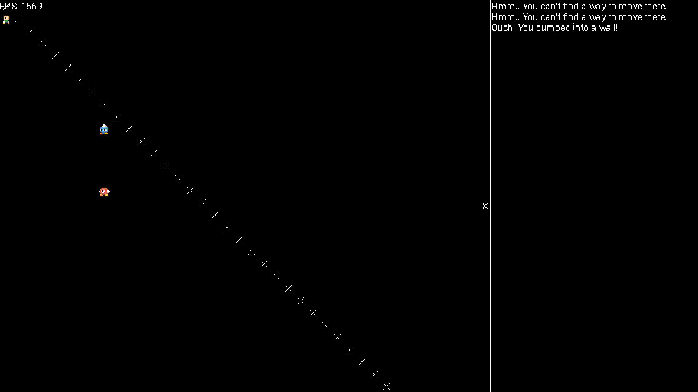

# HSRogue Demo



## What is this?
This is an attempt at a game in Haskell in the form of a short demo. It uses an ECS library called [Apecs](https://hackage.haskell.org/package/apecs) along with a wrapper for [SDL2](https://hackage.haskell.org/package/sdl2). 

## How did I make this?
I blogged heavily about my use of Apecs in this demo. You can find it on my blog [here](https://blog.aas.sh/posts/2018-09-10-Making-A-Game-With-Haskell-And-Apecs/).

## How do I play?

You can use the Vim keys (`HJKL` for left, down, up and right, with `YUBN` for diagonals), arrow keys and the mouse to move around. Right click or use the `;` key to look around and examine things. If you bump into a hostile entity, you will attack. Attacks are simply random and the system didn't go very deep into it, so it's just luck of the draw whether you win the fight or not. There is no objective, this is a demo.

## Why did development stop

I decided to release the code to the public because of the performance issues I'm having. If you render a lot of text or render more wall tiles to draw *X*s all over the screen, FPS drops dramatically. This limits the scope of the game quite a bit unfortunately. I believe this is for a number of things, but I suspect that SDL2's lack of sprite batching is to blame along with Haskell not being as fast as C++. Still, there may be a way to fix this, and maybe I'll start development again privately if there's some light shed. Until then, I'm going to make non-graphical Haskell projects.

> **To reproduce performance issues:** Head to `Main.hs` line 37. Instead of the function `generateIdentityMap`, instead use `generateBlankMap` and pass in `Solid` to fill the entire map with walls and therefore create more things to render. Function definitions shown below for more info.

```hs
-- Easy function for a blank map
generateBlankMap :: V2 Int -> Tile -> Matrix Tile
generateBlankMap (V2 w h) t = matrix w h (const t)

-- Identity map
generateIdentityMap :: V2 Int -> Matrix Tile
generateIdentityMap (V2 w h) = matrix w h (\(x, y) ->
if x == y then Solid else Empty)
```

## Mechanics

### Pathfinding

Simply click with the mouse to pathfind to a destination using [AStar pathfinding](https://hackage.haskell.org/package/astar). Works nicely if you don't know how to use the Vim keybindings.

### AI & Factions

There is a small but functional relationship system, and the spawning of the three entities in `Main.hs` is where you declare their faction. The faction *Edgelords* are hostile to the player and with the entity named Tum being aggressive he will hunt you down if you get within it's sensing range. Chum, however, is defensive, and will only attack if you attack him first or if a friend of his needs help. Tum will actually share his current target with Chum if he collides with him, making it so that you cannot hide behind Chum to get away from Tum.

```hs
-- For defining relationships with people
-- Faction: Who the character aligns with
-- Attitude: For defining how a faction reacts to another
-- Nature: How an individual acts (whether they fight or not)
type Faction = String
data Attitude = Friendly | Neutral | Hostile deriving (Show, Eq)
data Nature = Passive | Defensive | Aggressive deriving (Show, Eq)
type RelationshipTable = HM.HashMap Faction (HM.HashMap Faction Attitude)
```

### Stats & Energy system

Every character starts with `initialStats`, 10 in everything. However, increasing your `Speed` stat will give you more energy regen per round. This works in a similar way to other roguelikes, where you *spend* energy when you attempt to do something like move or attack. *Spending* here, actually means accumilating debt in this system though. Moving or attacking uses 100 energy, meaning that you cannot do any new actions until your energy hits 0. Your `speed` stat is how much energy you regain a round, meaning that a higher speed stat will allow you to do more actions in the time it takes for someone else to regain their energy (a speed stat of 20 instead of 10 would allow you to attack every 5 rounds rather than 10, given that an attack costs 100 energy).

Note that rounds are skipped, so a fast enemy will simply attack twice instantaneously - 10 rounds goes by in a single keypress.

```hs

-- Generic character stats
-- Dictates character abilities and combat stats
data Stats = 
  Stats
    { strength :: Int
    , agility :: Int
    , toughness :: Int
    , speed :: Int
} deriving Show

-- Calculate combat stats based on stats, equipment, skills and auras
calculateCombatStats :: Stats -> CombatStats
calculateCombatStats s = 
  CombatStats 
    { healthRegen = 1
    , energyRegen = speed s
    , maxHealth = 20 * toughness s
    , criticalChance = agility s
    , criticalMult = 1.5
    , bonusDamage = 0
    , visionRange = 3
}

-- Make a character spend energy
spendEnergy :: Entity -> Int -> System' ()
spendEnergy e cost = do
  Character c <- get e
set e $ Character $ c {energy = cost}
```
